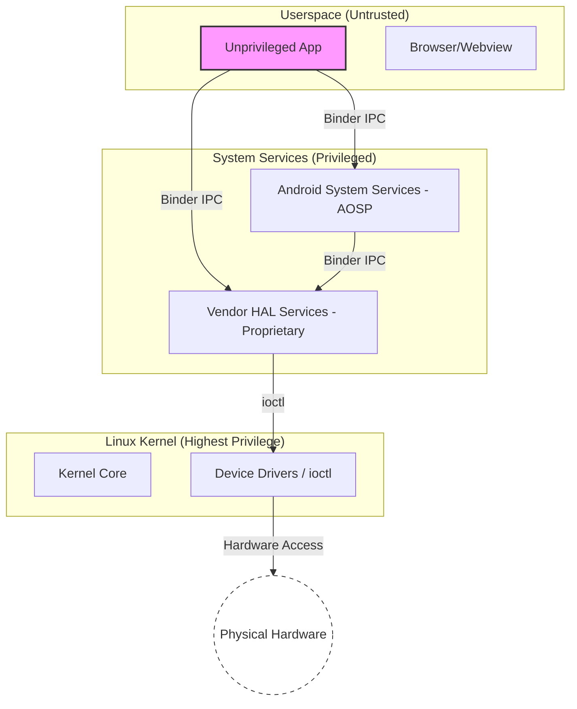
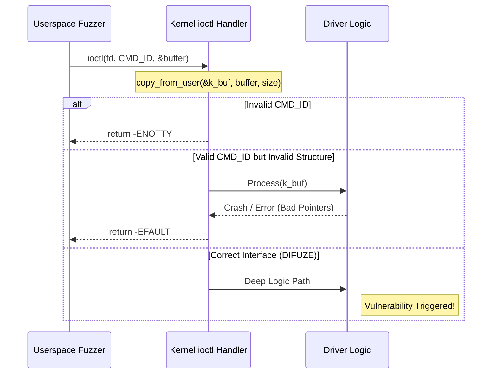

# Chapter 2: Background

To understand the evolution of interface-aware fuzzing on Android, we must first establish the foundational concepts of modern fuzzing, the specific architectural constraints of the Android operating system, and the nature of the communication interfaces that bridge its privilege levels.

## 2.1 Fuzzing Concepts

Fuzzing, or fuzz testing, is an automated software testing technique that involves providing invalid, unexpected, or random data as inputs to a computer program. The program is then monitored for exceptions such as crashes, failing built-in code assertions, or potential memory leaks.

### Traditional Techniques: Mutation vs. Generation
Fuzzers generally fall into two categories based on how they produce inputs:
*   **Mutation-based fuzzers** take a set of existing, valid inputs (a seed corpus) and apply various modifications—such as bit-flipping, byte swapping, or block shuffling—to create new test cases. These are highly automated but struggle to pass deep validation checks if the input format is highly structured (e.g., checksums, magic bytes, or specific nested pointers). When faced with a complex interface, a mutation fuzzer will almost always generate an input that is rejected at the very first parsing stage.
*   **Generation-based fuzzers** attempt to solve this by creating inputs from scratch based on a predefined model or grammar of the expected input format. While much more effective at reaching deep logic, they require significant manual effort to define the model for every single target. For an OS like Android with thousands of proprietary interfaces, writing these models by hand is simply impossible.

### Coverage-Guided Fuzzing
Modern grey-box fuzzers, such as AFL (American Fuzzy Lop) and LibFuzzer, use lightweight compiler instrumentation to track which parts of the target code are executed by a given input. By favoring inputs that discover new execution paths (code coverage), the fuzzer "evolves" toward more complex and deeper logic. This helps the fuzzer explore the program's state space without requiring a full formal model. However, even coverage guidance fails if the fuzzer cannot get past the initial structural validation checks of an interface. 

This is exactly why **interface-aware fuzzing** made such a massive difference in OS security. By automatically learning the required structures, an interface-aware fuzzer acts as an automated, generation-based fuzzer that can instantly adapt to thousands of different drivers or services, completely bypassing the manual modeling bottleneck.

## 2.2 Android’s Architecture and Attack Surface

Android is a layered operating system built on top of the Linux kernel. Its security model relies heavily on the "sandbox" principle, where applications run with minimal privileges and are isolated from each other and the core system.



### The Linux Kernel and Drivers
At the lowest level, the Linux kernel manages hardware resources. Kernel device drivers, often implemented as loadable modules, provide the interface between userspace and the hardware. Because the kernel runs with the highest possible privileges, a vulnerability in a driver can lead to full system compromise. 

### Monolithic Kernel Registration
In the Linux monolithic model, drivers must register themselves with the kernel to be reachable from userspace. This is typically done through structures like `file_operations` for character devices. The registration process involves functions such as `register_chrdev` or the more modern `misc_register`. These functions associate a major/minor number or a device name (e.g., "binder", "ion") with a set of handler functions that the kernel calls when a userspace process performs a system call on the corresponding device file.

## 2.3 The ioctl Interface

The primary mechanism for userspace-to-kernel communication in POSIX-compliant systems is the `ioctl` (input/output control) system call. While standard calls like `read` and `write` handle data streams, `ioctl` is the "Swiss Army knife" for device-specific operations.

The signature of the call is:
```c
int ioctl(int fd, unsigned long request, ...);
```

### 2.3.1 ioctl Command Encoding
According to the Linux kernel design, the `request` parameter (often called the command ID) is not merely a random integer. It is a 32-bit encoded structure containing four specific bitfields, which determine which driver-specific function to execute and what data format it expects. As noted in the DIFUZE paper, a valid `ioctl` command ID is composed of:
1.  **Direction (2 bits):** Specifies if data is being read (`_IOR`), written (`_IOW`), both (`_IOWR`), or neither (`_IO`).
2.  **Size (14 bits):** The size of the expected data structure passed in the third argument.
3.  **Type/Magic (8 bits):** A unique identifier for the specific device driver (e.g., `'V'` for Video4Linux).
4.  **Number (8 bits):** The specific command sequence number.

The third argument to `ioctl` is a variadic parameter, but in practice, it is almost always a pointer to a userspace memory buffer containing the serialized command data.

### 2.3.2 The Deserialization Barrier
The fundamental challenge for fuzzing `ioctl` is the **deserialization barrier**. When a driver receives an `ioctl` call, it must parse the `request` bitfields and then copy the data from the userspace pointer into kernel memory using functions like `copy_from_user`.



If the fuzzer provides a pointer to a buffer that is too small, or contains invalid pointers that the driver tries to dereference later, the kernel will either return an error immediately or, worse, suffer a memory corruption that leads to a system crash (kernel panic).

## 2.4 Android System Services and Binder

Above the kernel, Android's functionality is provided by **system services**. These daemons run in their own privileged processes and expose their functionality through Inter-Process Communication (IPC).

### 2.4.1 Project Treble and the HAL
With Project Treble (Android 8+), Google introduced a clear separation between the Android OS framework and vendor-specific hardware implementations. This is achieved through the **Hardware Abstraction Layer (HAL)**. HAL services often run as native C++ processes (e.g., `android.hardware.camera@2.4-service`) and are highly privileged, as they have direct access to the kernel drivers required to drive the hardware.

### 2.4.2 The Binder Serialization Protocol
Binder IPC uses a specialized serialization format called **Parcel**. When a client calls a remote service, it writes arguments into a Parcel using methods like `writeInt32`, `writeString16`, or `writeStrongBinder`. 

A Parcel is essentially a linear byte stream that sequentially packs these data types. For example, writing a 32-bit integer followed by a 16-bit string appends the raw bytes for the integer, followed by the length of the string, and then the string characters themselves, aligned to 4-byte boundaries.

On the server side, the `onTransact` method reads these values in the exact same order using corresponding `read` methods. The server-side stub logic acts as a strict deserialization firewall:

```cpp
// Simplified Binder transaction handling
status_t onTransact(uint32_t code, const Parcel& data, Parcel* reply, uint32_t flags) {
    switch(code) {
        case TRANSACTION_doSomething: {
            data.enforceInterface(descriptor);
            int32_t arg1 = data.readInt32(); // Read must match write
            String16 arg2 = data.readString16();
            // ... invoke actual service logic
            return NO_ERROR;
        }
        // ...
    }
    return UNKNOWN_TRANSACTION;
}
```

Any deviation in the order or type of data in the Parcel causes the transaction to fail, effectively acting as a "firewall" against malformed inputs.

## 2.5 The Running Example: The Camera Module

To illustrate the evolution of interface-aware fuzzing, this thesis will use a "Camera Module" as a consistent running example:
1.  **At the Kernel Level:** The camera hardware is driven by a kernel-level V4L2 (Video4Linux2) driver, which exposes dozens of complex `ioctl` commands for controlling focus, exposure, and frame buffers.
2.  **At the Open-Source Service Level:** The Android framework provides a `cameraserver` daemon. Its interface is defined in AIDL (Android Interface Definition Language), making its structure visible to anyone with access to the Android Open Source Project (AOSP).
3.  **At the Proprietary HAL Level:** On a commercial device (like a Samsung or Pixel), the `cameraserver` talks to a vendor-specific HAL service (e.g., `vendor.qti.hardware.camera`). This service is closed-source and implements proprietary post-processing algorithms, representing a massive but hidden attack surface.
