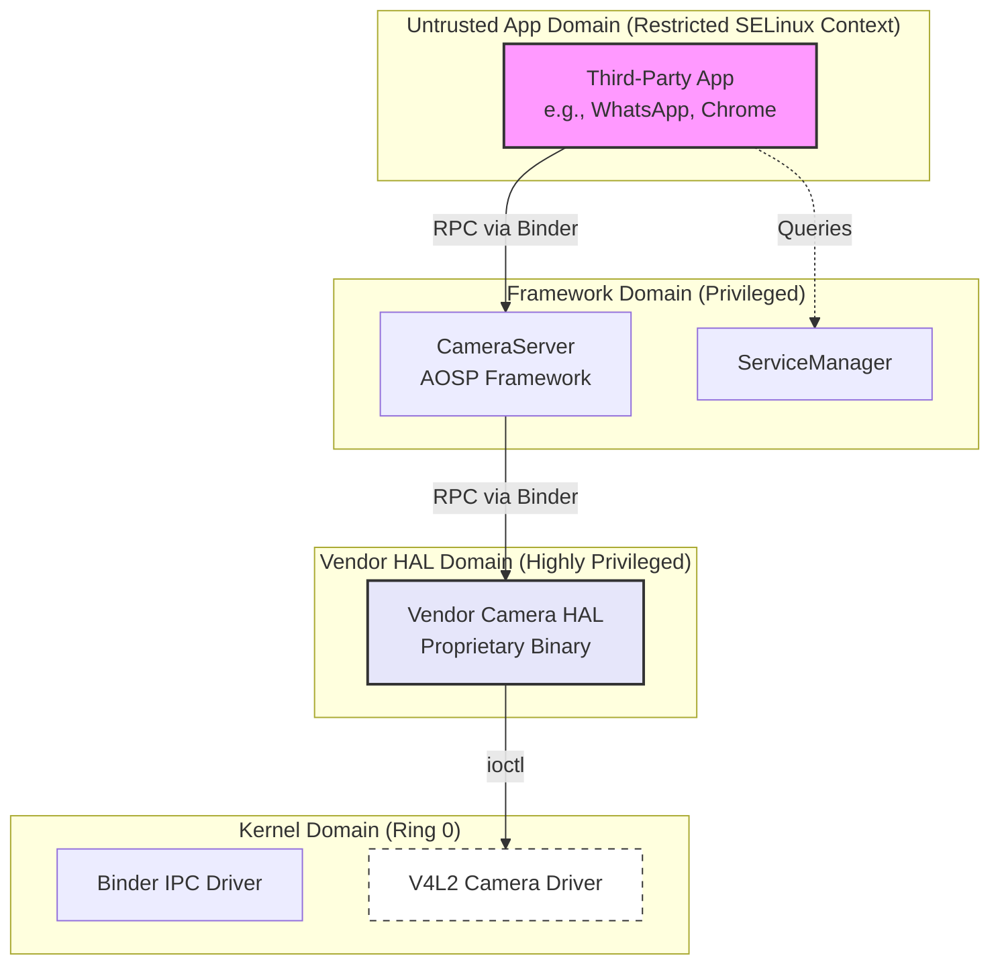

# Chapter 2: Background

To fully appreciate the innovations introduced by DIFUZE, FANS, and NASS, it is necessary to establish a firm understanding of the technical landscape they operate within. This chapter provides the foundational context for the rest of the thesis, covering the mechanics of modern fuzzing, the specific architectural and security constraints of the Android operating system, and the intricate communication interfaces that bridge its privilege domains.

## 2.1 Fuzzing: From Random Mutation to Interface Awareness

Fuzz testing, colloquially known as fuzzing, is a dynamic software testing technique designed to discover coding errors and security loopholes. It achieves this by automatically feeding a target program a massive volume of invalid, unexpected, or pseudo-random data, monitoring the execution for anomalous behaviors such as memory-corruption crashes, assertion failures, or resource leaks.

### 2.1.1 Mutation vs. Generation
At a high level, fuzzers can be categorized by how they generate their test cases:

*   **Mutation-Based Fuzzers:** These systems begin with a "seed corpus"—a collection of valid, well-formed inputs. The fuzzer applies a series of heuristic mutations to these seeds, such as bit-flipping, byte swapping, block splicing, or arithmetic alterations. While highly automated and easily scalable, mutation-based fuzzers struggle immensely when the target program expects highly structured data. If a mutation inadvertently corrupts a critical checksum, a magic header, or a structural offset, the target program's parsing logic will immediately reject the input.
*   **Generation-Based Fuzzers:** These fuzzers construct inputs entirely from scratch based on a predefined grammar or structural model of the expected input format. Because they "know" the rules, they can generate inputs that effortlessly pass superficial parsing checks, allowing them to test the deeper business logic of the application. The primary drawback is the immense manual effort required to reverse-engineer and specify these grammatical models for every new target.

When targeting an operating system like Android, which exposes thousands of unique, often undocumented interfaces across its kernel and userspace daemons, manually writing generation models is an intractable task. 

### 2.1.2 The Grey-Box Revolution and Coverage Guidance
For many years, fuzzers operated as "black boxes," blasting inputs at a target with no knowledge of what the target was actually doing with that data. The advent of **grey-box fuzzing** (popularized by tools like American Fuzzy Lop, or AFL) revolutionized the field. 

Grey-box fuzzers inject lightweight instrumentation into the target program during compilation (or dynamically at runtime). This instrumentation allows the fuzzer to track exactly which basic blocks of code are executed by a specific input. If a newly mutated input triggers a previously unseen code path, the fuzzer recognizes that this input is "interesting" and adds it to the seed corpus for further mutation. This evolutionary loop allows the fuzzer to organically discover and navigate complex state spaces.

However, a fundamental limitation remains: coverage guidance is useless if the fuzzer cannot get past the front door. If 99.9% of mutated inputs are rejected by an initial structural check (e.g., `if (input_size < EXPECTED_SIZE) return ERROR;`), the fuzzer will never see new code coverage and will stall entirely. This structural roadblock is precisely what necessitates **interface-aware fuzzing**—systems that automatically learn the required input models to bypass these initial parsers, allowing the power of coverage-guided fuzzing to finally reach the core logic.

## 2.2 Android's Architecture and the Security Sandbox

Android is a complex, multi-layered operating system built atop a modified Linux kernel. Its architecture is explicitly designed around the principle of least privilege, relying on strict sandboxing to isolate untrusted code from critical system resources.



### 2.2.1 SELinux and Privilege Escalation
In modern Android, discretionary access control (standard Linux UIDs and GIDs) is heavily augmented by Mandatory Access Control (MAC) via Security-Enhanced Linux (SELinux). Every process and file is assigned a specific SELinux context, and policies strictly define which contexts can interact.

A third-party app runs in a highly restricted, heavily sandboxed domain. It is denied direct access to almost all hardware device nodes (e.g., `/dev/video0`). If a vulnerability exists in a kernel camera driver, an app cannot exploit it simply because SELinux prevents the app from opening the driver's device file.

To legitimately access the camera, the app must ask a privileged intermediary: a system service. System services operate in elevated SELinux domains that are explicitly granted access to specific hardware drivers. This architecture explains why native system services have become prime targets for attackers. If a malicious app can discover and exploit a vulnerability in a privileged system service via a legitimate communication channel, it can hijack the service's elevated SELinux context, effectively "escalating its privileges" and gaining indirect access to the underlying kernel.

## 2.3 The Communication Bridges: ioctl and Binder IPC

Because Android's architecture relies on distinct, isolated processes communicating with one another and the kernel, the interfaces that bridge these privilege gaps are the focal points of security analysis.

### 2.3.1 The Kernel Boundary: ioctl
For userspace processes communicating directly with the Linux kernel (such as a highly privileged HAL service talking to a hardware driver), the standard POSIX `ioctl` (Input/Output Control) system call is the primary mechanism.

The `ioctl` system call is intentionally generic, designed to handle device-specific operations that do not map cleanly to standard file operations like `read` or `write`. Its signature is deceptively simple:
```c
int ioctl(int fd, unsigned long request, ...);
```
The true complexity lies in the `request` parameter (the command ID) and the variadic third argument, which is almost universally a pointer to a userspace data structure. When a driver receives an `ioctl` call, it uses the command ID to determine which internal function to execute. It then explicitly copies the data from the provided userspace pointer into kernel memory using functions like `copy_from_user()`.

If we consider a kernel-level **Camera Module** driver (often implemented via the Video4Linux2 or V4L2 subsystem), an `ioctl` call might be used to set the camera's crop dimensions. The userspace process provides a command ID like `VIDIOC_S_CROP` and a pointer to a `v4l2_crop` C-structure containing the coordinates.

This presents a massive "deserialization barrier" for a fuzzer. If the fuzzer provides a valid `VIDIOC_S_CROP` command but passes a pointer to a randomly generated buffer, the kernel driver will attempt to interpret that garbage data as a `v4l2_crop` structure. If the driver logic expects certain fields to contain valid nested pointers, or array lengths that align with actual buffer sizes, the random data will cause the driver to read out of bounds or crash the entire system with a kernel panic. To fuzz an `ioctl` interface, the fuzzer must know the exact C-structure expected for every single command ID.

### 2.3.2 The Userspace Boundary: Binder IPC
In userspace, Android relies on a custom Remote Procedure Call (RPC) mechanism known as **Binder**. When an app wants to use the camera, it does not make syscalls directly; instead, it looks up the `cameraserver` daemon via the `ServiceManager` and initiates a Binder transaction.

Binder communication relies on a Proxy/Stub architecture. The client app uses a Proxy object to pack the arguments of the function call into a specialized, linear serialization container called a **Parcel**. This Parcel is then transmitted via the `/dev/binder` kernel driver to the target service.

On the receiving end, the service's Stub object receives the Parcel and must unpack it in the exact order it was packed. This deserialization happens in a centralized dispatch function called `onTransact`.

```cpp
// A simplified conceptual example of a Binder Server Stub for a Camera Module
status_t CameraService::onTransact(uint32_t code, const Parcel& data, Parcel* reply, uint32_t flags) {
    switch (code) {
        case CONNECT_CAMERA: {
            // Strict deserialization sequence
            int32_t cameraId = data.readInt32();
            String16 clientPackageName = data.readString16();
            
            // If the data doesn't match this exact layout, the transaction fails organically.
            // Only if parsing succeeds does the business logic execute:
            status_t result = this->connectCamera(cameraId, clientPackageName);
            reply->writeInt32(result);
            return NO_ERROR;
        }
        // ...
    }
    return UNKNOWN_TRANSACTION;
}
```

This strict packing and unpacking process is the userspace equivalent of the `ioctl` barrier. A fuzzer cannot simply send random bytes in a Parcel; it must send bytes that perfectly mimic the expected sequence of `readInt32()`, `readString16()`, or other standard deserialization calls.

## 2.4 Universal RPC Design Principles

As Android security research advanced from analyzing `ioctl` in the kernel to Binder in userspace, a crucial realization emerged: despite their different implementations, all modern RPC frameworks share fundamental architectural similarities. The researchers behind NASS formalized these into three universal **RPC Design Principles**—Ab, Si, and St—which provide the theoretical foundation for dynamically analyzing closed-source binaries.

1.  **Ab (Abstraction of IPC binding code):** Good software engineering dictates that the messy details of inter-process communication should not pollute the actual business logic of an application. Therefore, RPC frameworks automatically generate a "stub" layer. This stub is solely responsible for verifying the IPC connection and deserializing the data. Only if deserialization succeeds does the stub call the actual, manually written service logic.
2.  **Si (Single entry point):** All incoming remote requests are routed through a single, predictable function signature. In Binder, this is the `onTransact` method. For a security researcher, this provides a reliable, universal location to place a hook and monitor incoming traffic.
3.  **St (Standard deserialization routines):** To ensure that a client app written in Java can successfully talk to a system service written in C++, the serialization format must be highly standardized. The server stub does not write custom byte-parsing logic; instead, it relies on a shared runtime library (e.g., `libbinder.so`) to call standard routines like `readInt32` or `readString16`.

These three principles mean that the "front door" of almost any Android system service operates in a highly predictable, standardized manner, regardless of how complex or proprietary the hidden business logic behind that door might be. As we will see in the subsequent chapters, exploiting these principles is the key to automating the discovery of vulnerabilities at scale.
