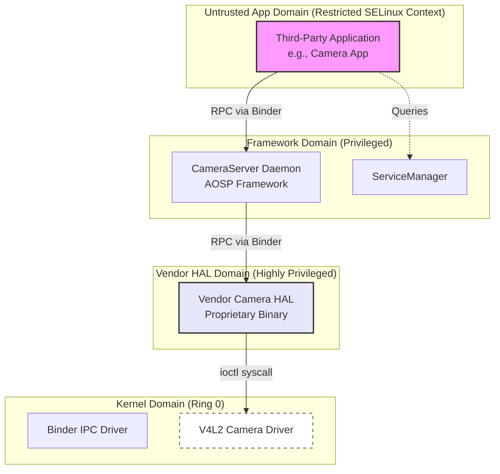

# Chapter 2: Technical Background

Understanding the evolution of Android fuzzing requires an examination of the underlying technical landscape. This chapter establishes the foundational concepts for the thesis. It covers modern fuzzing methodologies, details Android's privilege architecture, and analyzes the critical communication interfaces (`ioctl` and Binder) that span different security domains.

## 2.1 Fuzzing Methodologies and the Coverage Imperative

Fuzz testing, or fuzzing, is a dynamic software testing technique. It involves providing a target program with a large volume of invalid, unexpected, or random data to monitor for anomalous behavior, such as crashes, assertion failures, or memory leaks.

Fuzzers generally fall into two categories based on their test case generation strategies:

*   **Mutation-Based Fuzzers:** These begin with a "seed corpus"—a set of valid inputs. The fuzzer applies modifications to these seeds, such as bit flipping or byte swapping. While highly scalable, this approach struggles when the target expects highly structured data. A simple mutation can easily invalidate structural offsets or magic headers, causing the program's parsing logic to reject the input immediately.
*   **Generation-Based Fuzzers:** These construct inputs from scratch based on a predefined grammar or structural model. Because they adhere to these rules, the generated inputs typically pass initial parsing checks. The primary disadvantage is the significant manual effort required to reverse-engineer and define these grammar models for each new target.

The emergence of **grey-box fuzzing**, popularized by tools like American Fuzzy Lop (AFL) and Syzkaller, marked a significant advancement. Grey-box fuzzers employ lightweight instrumentation—inserted either during compilation or dynamically at runtime—to track the specific code blocks executed by an input. If an input triggers a previously unseen code path, it is deemed "interesting" and added to the seed corpus for further mutation. This evolutionary feedback loop allows the fuzzer to navigate complex state spaces without the exhaustive manual modeling required by pure generation-based fuzzers.

However, coverage guidance is ineffective if the fuzzer cannot bypass initial parsing checks. If the vast majority of inputs are rejected during basic structural validation, the fuzzer will fail to trigger new code coverage and stall. This limitation necessitates **interface-aware fuzzing**. By automatically learning the required input models, these systems can bypass initial parsers and apply coverage-guided fuzzing to the core application logic.

## 2.2 Android's Privilege Architecture and SELinux

Android's operating system, built on a modified Linux kernel, employs a security model based on the principle of least privilege. It utilizes strict sandboxes to isolate untrusted code from critical system resources.



In modern Android, standard Linux permissions are reinforced by Mandatory Access Control (MAC) via Security-Enhanced Linux (SELinux). Every process and file is assigned a specific SELinux context, and strict policies govern their interactions.

A third-party application runs within a highly restricted sandbox, explicitly denied direct access to most hardware device nodes (e.g., `/dev/video0`). Consequently, a malicious app cannot directly exploit a vulnerability in a kernel camera driver because SELinux prevents it from opening the device file.

To access hardware legitimately, an app must communicate with a privileged intermediary: a **system service**. These services operate in elevated SELinux domains permitted to interact with specific hardware drivers. "Project Treble," introduced in Android 8, further modularized this architecture by relocating hardware-specific logic into a separate Vendor Hardware Abstraction Layer (HAL).

This architecture explains why native system services, particularly within the HAL, are prime targets. Exploiting a vulnerability in a privileged system service via a legitimate communication channel allows an attacker to hijack its elevated SELinux context. This indirect escalation provides a pathway to the underlying kernel.

## 2.3 The Kernel Boundary: ioctl

When userspace processes require direct communication with the Linux kernel—such as a HAL service interacting with a hardware driver—they typically use the standard POSIX `ioctl` (Input/Output Control) system call.

The `ioctl` system call is designed for generic, device-specific operations that do not fit standard read/write paradigms. Its signature is straightforward:

```c
int ioctl(int fd, unsigned long request, ...);
```

The complexity lies within the `request` parameter (command ID) and the variadic third argument, which is almost universally a pointer to a driver-defined userspace data structure. Upon receiving an `ioctl` call, a driver uses the command ID to determine the appropriate internal function, then copies data from the userspace pointer into kernel memory using functions like `copy_from_user()`.

Returning to the **Android Camera Subsystem** example, a camera HAL service might use an `ioctl` to configure lens calibration. This requires a specific command ID (e.g., `VIDIOC_S_SENSOR_CONFIG`) and a pointer to a structured C-struct:

```c
struct camera_sensor_config {
    int sensor_id;
    int resolution_width;
    int resolution_height;
    struct lens_calibration_data *calibration_ptr; // Nested pointer
};

struct lens_calibration_data {
    int focal_length;
    char manufacturer_string[32];
};
```

This structure creates a significant "deserialization barrier" for a traditional fuzzer. If the fuzzer provides a pointer to a randomly generated buffer, the kernel driver will interpret that data as a `camera_sensor_config` structure. When the driver attempts to validate the `calibration_ptr`—which contains random bytes—it will attempt an invalid memory access. This triggers a kernel panic, halting the system before the fuzzer can explore the sensor configuration code.

## 2.4 The Userspace Boundary: Binder IPC Architecture

While `ioctl` bridges the userspace and kernel, communication *between* userspace processes (e.g., an app and a framework service) relies on a custom Remote Procedure Call (RPC) mechanism: **Binder**.

When an app accesses the camera, it requests a handle to the `cameraserver` daemon from the `ServiceManager` and initiates a Binder transaction. Binder employs a Proxy/Stub architecture. The client uses a Proxy object to pack function arguments into a linear container called a `Parcel`. This `Parcel` is transmitted via the `/dev/binder` kernel driver to the target service.

The receiving service's Stub object unpacks the `Parcel` within a centralized dispatch function, `onTransact`.

```cpp
// Simplified Binder Server Stub (AOSP pattern)
status_t CameraDevice::onTransact(uint32_t code, const Parcel& data, Parcel* reply, uint32_t flags) {
    switch (code) {
        case CAPTURE_IMAGE: {
            // 1. Verify Interface Token
            CHECK_INTERFACE(ICameraDevice, data, reply);

            // 2. Sequential Deserialization
            int32_t session_id;
            if (data.readInt32(&session_id) != NO_ERROR) return BAD_VALUE;
            
            String16 package_name;
            if (data.readString16(&package_name) != NO_ERROR) return BAD_VALUE;
            
            // 3. Execution upon successful unpacking
            status_t res = this->captureImage(session_id, package_name);
            reply->writeInt32(res);
            return NO_ERROR;
        }
        default:
            return BBinder::onTransact(code, data, reply, flags);
    }
}
```

This packing and unpacking process is the userspace equivalent of the `ioctl` barrier. A fuzzer must send a byte stream that precisely matches the server's expected sequence of deserialization calls.

### 2.4.1 Android Interface Definition Language (AIDL)

To understand why this deserialization process is so structured, it is necessary to understand how these server stubs are created. Android developers typically do not write raw `onTransact` C++ dispatchers by hand. Instead, they define the interface using the **Android Interface Definition Language (AIDL)**.

An AIDL file (e.g., `ICameraDevice.aidl`) defines the method signatures exposed by the service. During the Android build process, the AIDL compiler automatically generates the corresponding C++ Proxy and Stub classes. The generated Stub class contains the `onTransact` method, automatically populating it with the exact standard library calls needed to deserialize the arguments defined in the AIDL file before passing them to the developer's actual implementation.

This reliance on machine-generated code is what makes the interface predictable. Because the stubs are auto-generated rather than hand-crafted, they adhere strictly to a set of universal design principles.

### 2.4.2 Universal RPC Design Principles

As research expanded from `ioctl` to Binder, a key observation emerged: modern RPC frameworks (Binder, gRPC, Thrift) share fundamental architectural similarities. These similarities provide a theoretical basis for systematic analysis, often categorized into three universal **RPC Design Principles**:

1.  **Ab (Abstraction of IPC binding code):** Low-level inter-process communication details are separated from the application's business logic. Auto-generated "stub" layers typically handle IPC verification and deserialization.
2.  **Si (Single Entry Point):** Incoming remote requests are routed through a single, predictable function signature (e.g., `onTransact` in Binder). This offers a reliable location for monitoring traffic.
3.  **St (Standard Deserialization Routines):** Serialization formats are highly standardized to ensure interoperability. Server stubs rely on shared runtime libraries (e.g., `libbinder.so`) to call standard routines like `readInt32` or `readString16`, rather than implementing custom parsing logic.

Due to these principles, the initial processing layer of most Android system services operates predictably. Exploiting these principles, as detailed in subsequent chapters, is essential for automating vulnerability discovery at scale.