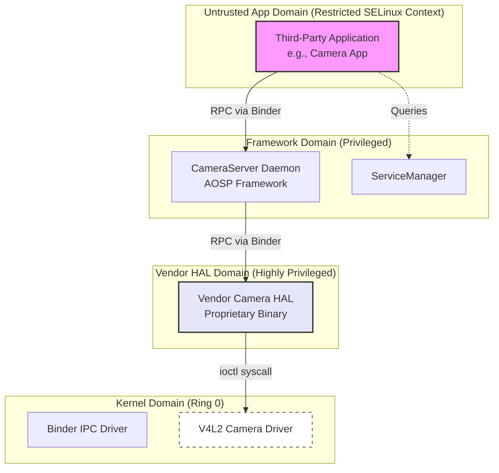

# Chapter 2: Technical Background

To really understand how Android fuzzing has evolved, we need to look at the underlying technical landscape. This chapter sets up the foundational concepts for the rest of the thesis. I'll go over modern fuzzing methodologies, explain Android's privilege architecture, and break down the critical communication interfaces (`ioctl` and Binder) that bridge the gaps between different security domains.

## 2.1 Fuzzing Methodologies and the Coverage Imperative

Fuzz testing, or simply fuzzing, is a dynamic software testing technique. The basic idea is to throw a massive volume of invalid, unexpected, or random data at a target program and watch for anomalous behavior. You're basically looking for crashes, assertion failures, or memory leaks.

Fuzzers generally fall into two main categories based on how they generate their test cases:

*   **Mutation-Based Fuzzers:** These start with a "seed corpus"—a set of valid, known-good inputs. The fuzzer takes these seeds and applies a series of random modifications, like flipping bits or swapping bytes. While this approach is easy to scale, it struggles heavily when the target program expects highly structured data. A simple bit flip can easily invalidate a structural offset or a magic header, causing the program's parser to reject the input immediately.
*   **Generation-Based Fuzzers:** These build inputs completely from scratch based on a predefined grammar or structural model. Because they follow the rules, the inputs they generate usually pass initial parsing checks. The obvious downside here is the massive amount of manual effort required to reverse-engineer and write out these grammar models for every new target you want to test.

A huge milestone in this field was the rise of **grey-box fuzzing**, popularized by tools like American Fuzzy Lop (AFL) and Syzkaller (used extensively for kernel fuzzing). Grey-box fuzzers use lightweight instrumentation—inserted either during compilation or dynamically at runtime—to track the specific blocks of code executed by a given input. If a mutated input happens to trigger a previously unseen code path, the fuzzer considers it "interesting" and saves it to the seed corpus for further mutation. This evolutionary feedback loop lets the fuzzer organically navigate complex state spaces without needing the exhaustive manual modeling that pure generation-based fuzzers require.

But there's still a catch: coverage guidance is totally ineffective if the fuzzer can't bypass the initial parsing checks. If 99.9% of the generated inputs are rejected during basic structural validation, the fuzzer will fail to trigger new code coverage and will just stall out. This is exactly why **interface-aware fuzzing** is necessary. By automatically learning the required input models, these systems can bypass the initial parsers and finally apply coverage-guided fuzzing to the core application logic.

## 2.2 Android's Privilege Architecture and SELinux

Android is built on top of a modified Linux kernel, and its security model is heavily based on the principle of least privilege. It uses strict sandboxes to isolate untrusted code from critical system resources.



In modern Android, standard Linux permissions (like UIDs and GIDs) are reinforced by Mandatory Access Control (MAC) via Security-Enhanced Linux (SELinux). Every single process and file is assigned a specific SELinux context, and strict policies dictate how they can interact.

When you install a third-party application, it runs within a highly restricted sandbox. It is explicitly denied direct access to most hardware device nodes (like `/dev/video0`). As a result, a malicious app can't directly exploit a vulnerability in a kernel camera driver because SELinux simply prevents it from opening the device file in the first place.

To access hardware legitimately, an app must communicate with a privileged intermediary: a **system service**. These services operate in elevated SELinux domains that are actually permitted to interact with specific hardware drivers. The introduction of "Project Treble" in Android 8 further modularized this architecture by moving hardware-specific logic into a separate Vendor Hardware Abstraction Layer (HAL).

This setup perfectly explains why native system services, particularly those within the HAL, are prime targets. If an attacker can exploit a vulnerability in a privileged system service via a legitimate communication channel, they can hijack its elevated SELinux context. This indirect escalation provides a clear pathway to the underlying kernel.

## 2.3 The Kernel Boundary: ioctl

When userspace processes need to communicate directly with the Linux kernel—such as a HAL service interacting with a physical hardware driver—they typically use the standard POSIX `ioctl` (Input/Output Control) system call.

The `ioctl` system call is designed to be a catch-all for generic, device-specific operations that don't neatly fit standard read/write paradigms. Its signature is deceptively simple:

```c
int ioctl(int fd, unsigned long request, ...);
```

The real complexity lies within the `request` parameter (the command ID) and the variadic third argument. This third argument is almost universally a pointer to a driver-defined userspace data structure. Upon receiving an `ioctl` call, a driver uses the command ID to figure out the appropriate internal function to run. Then, it copies data from the userspace pointer into kernel memory using functions like `copy_from_user()`.

Returning to our **Android Camera Subsystem** example, a camera HAL service might use an `ioctl` to configure lens calibration. This requires a specific command ID (e.g., `VIDIOC_S_SENSOR_CONFIG`) and a pointer to a structured C-struct:

```c
struct camera_sensor_config {
    int sensor_id;
    int resolution_width;
    int resolution_height;
    struct lens_calibration_data *calibration_ptr; // Nested pointer
};

struct lens_calibration_data {
    int focal_length;
    char manufacturer_string[32];
};
```

This nested structure creates a massive "deserialization barrier" for a traditional fuzzer. If the fuzzer provides a pointer to a randomly generated buffer, the kernel driver will try to interpret that garbage data as a `camera_sensor_config` structure. When the driver attempts to validate the `calibration_ptr`—which is just full of random bytes—it will attempt an invalid memory access. This triggers an immediate kernel panic, halting the entire system before the fuzzer can even explore the sensor configuration code.

## 2.4 The Userspace Boundary: Binder IPC Architecture

While `ioctl` bridges the gap between userspace and the kernel, communication *between* different userspace processes (e.g., an app talking to a framework service, or a framework service talking to a HAL service) relies on a custom Remote Procedure Call (RPC) mechanism called **Binder**.

When an app accesses the camera, it requests a handle to the `cameraserver` daemon from the `ServiceManager` and initiates a Binder transaction. Binder employs a Proxy/Stub architecture. The client uses a Proxy object to pack the function arguments into a specialized, linear container called a `Parcel`. This `Parcel` is then transmitted via the `/dev/binder` kernel driver over to the target service.

On the receiving end, the service's Stub object unpacks the `Parcel` within a centralized dispatch function called `onTransact`.

```cpp
// A simplified Binder Server Stub representing a standard AOSP pattern
status_t CameraDevice::onTransact(uint32_t code, const Parcel& data, Parcel* reply, uint32_t flags) {
    switch (code) {
        case CAPTURE_IMAGE: {
            // 1. Verify Interface Token
            CHECK_INTERFACE(ICameraDevice, data, reply);

            // 2. Sequential Deserialization
            int32_t session_id;
            if (data.readInt32(&session_id) != NO_ERROR) return BAD_VALUE;
            
            String16 package_name;
            if (data.readString16(&package_name) != NO_ERROR) return BAD_VALUE;
            
            // 3. Execution upon successful unpacking
            status_t res = this->captureImage(session_id, package_name);
            reply->writeInt32(res);
            return NO_ERROR;
        }
        default:
            return BBinder::onTransact(code, data, reply, flags);
    }
}
```

This packing and unpacking process is essentially the userspace equivalent of the `ioctl` barrier. A fuzzer must send a byte stream that precisely matches the server's expected sequence of deserialization calls.

### 2.4.1 Android Interface Definition Language (AIDL)

To understand why this deserialization process is so rigidly structured, it helps to look at how these server stubs are actually created. Android developers typically do not write raw `onTransact` C++ dispatchers by hand. Instead, they define the interface using the **Android Interface Definition Language (AIDL)**.

An AIDL file (e.g., `ICameraDevice.aidl`) simply defines the method signatures exposed by the service. During the Android build process, the AIDL compiler automatically generates the corresponding C++ Proxy and Stub classes. The generated Stub class contains the `onTransact` method, and the compiler automatically populates it with the exact standard library calls needed to deserialize the arguments defined in the AIDL file before passing them to the developer's actual implementation.

This heavy reliance on machine-generated code is what makes the interface predictable. Because the stubs are auto-generated rather than hand-crafted by individual developers, they adhere strictly to a set of universal design principles.

### 2.4.2 Universal RPC Design Principles

As security research expanded from `ioctl` to Binder, a key observation emerged: modern RPC frameworks (Binder, gRPC, Thrift) all share fundamental architectural similarities. These similarities provide a theoretical basis for systematic analysis, and they are generally categorized into three universal **RPC Design Principles**:

1.  **Ab (Abstraction of IPC binding code):** Low-level inter-process communication details are deliberately separated from the application's core business logic. Auto-generated "stub" layers typically handle IPC verification and data deserialization.
2.  **Si (Single Entry Point):** Incoming remote requests are routed through a single, predictable function signature (e.g., `onTransact` in Binder). This offers a reliable, universal location for monitoring network traffic.
3.  **St (Standard Deserialization Routines):** Serialization formats are highly standardized to ensure interoperability. Server stubs rely on shared runtime libraries (e.g., `libbinder.so`) to call standard routines like `readInt32` or `readString16`, rather than implementing their own custom parsing logic.

Due to these three principles, the initial processing layer of most Android system services operates in a very predictable manner. As we'll see in the following chapters, exploiting these principles is absolutely essential for automating vulnerability discovery at scale.