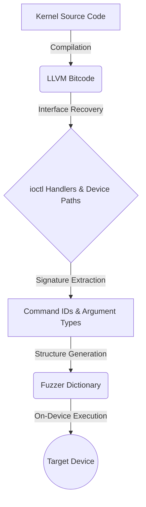

# Chapter 3: DIFUZE — Interface-Aware Fuzzing for Kernel Drivers

Published at CCS '17, **DIFUZE [1]** was the first system to directly address the "ioctl wall" by automatically recovering structured interface definitions from kernel source code. Before DIFUZE, fuzzing device drivers was largely a manual effort or relied on simplistic, interface-unaware techniques that were unable to penetrate the deep logic of the kernel.

## 3.1 The ioctl Challenge: The Running Example

In our running example, a camera driver on Android might implement a `v4l2_ioctl` function to handle hardware controls. When a userspace process calls `ioctl(fd, VIDIOC_S_CTRL, &arg)`, the kernel driver first receives the `VIDIOC_S_CTRL` command. 

If a fuzzer sends a random integer for the command ID, the driver's large `switch(cmd)` block will fall through to the `default` case, returning an error like `-ENOTTY` (Inappropriate ioctl for device). If the fuzzer miraculously guesses the command but provides a random buffer, the driver's subsequent `copy_from_user` call might fail due to an invalid pointer, or the driver might crash when it tries to dereference a field within the structure that it expects to be a pointer.

## 3.2 System Architecture: The LLVM Pipeline

DIFUZE solves this by performing static analysis on the driver source code using the LLVM compiler infrastructure. The pipeline consists of four major stages:
1.  **Build System Instrumentation:** Capturing the kernel build process to generate LLVM bitcode for the entire kernel.
2.  **Interface Recovery:** Identifying `ioctl` handlers and their corresponding device files.
3.  **Signature Extraction:** Determining valid command IDs and the types of the arguments they expect.
4.  **Structure Generation:** Automatically creating valid, semantically-correct inputs for on-device fuzzing.



## 3.3 ioctl Handler Identification and Device Mapping

DIFUZE identifies `ioctl` handlers by scanning for assignments to known kernel structures, such as `file_operations` and `v4l2_ioctl_ops`. By tracing these assignments, DIFUZE can precisely locate the entry point for every `ioctl` handler in the kernel.

Crucially, DIFUZE also recovers the **device path** (e.g., `/dev/video0`). It does this by tracing from the `ioctl` handler back through the registration functions. For instance, if a driver calls `misc_register(&my_misc_device)`, DIFUZE's analysis tracks the `my_misc_device` structure to find the name field (e.g., `"camera_ctrl"`), allowing the fuzzer to know exactly which file to open in userspace.

## 3.4 Signature Extraction: The Core Algorithms

This stage is the heart of DIFUZE's innovation, employing two specialized static analysis algorithms: Range Analysis and Type Propagation.

### 3.4.1 Command Value Recovery via Range Analysis
To find all valid `cmd` values, DIFUZE performs a path-sensitive inter-procedural analysis. Within the `ioctl` handler, it identifies all equality constraints placed on the `cmd` argument. 

DIFUZE uses **Range Analysis** to handle complex conditional dispatching:
*   **Switch Statements:** This is the most common dispatch method. DIFUZE's analysis easily extracts the exact constant values from each `case` label.
*   **If-Else Constraints:** Some drivers validate the command ID using relational operators (e.g., `if (cmd >= MIN_CMD && cmd <= MAX_CMD)`). Range Analysis evaluates these relational bounds to determine the continuous intervals of valid command IDs, ensuring the fuzzer doesn't waste time generating inputs that fall outside these permitted ranges.

### 3.4.2 Argument Type Recovery via Type Propagation
Once a command is identified, DIFUZE must determine the structure type expected for that specific command. It uses **Type Propagation** analysis to trace the third argument (the data pointer) through the function's control flow.

The analysis specifically looks for the point where the data is copied from userspace, such as a call to `copy_from_user(dest, src, size)`. By examining the type of the `dest` variable, DIFUZE recovers the exact structure definition. This process is complex because drivers often use wrapper functions, type casts to `void*`, and unions. DIFUZE's inter-procedural analysis allows it to maintain the correct type information across these boundaries.

## 3.5 Handling the Pointer Problem: Structure Fixup

The most difficult challenge in driver fuzzing is when a structure itself contains pointers to other structures (e.g., a "buffer list" structure containing a pointer to a "frame buffer" structure). 

DIFUZE handles this by a technique called **Pointer Fixup**:
1.  **Independent Generation:** It recursively generates definitions for every nested structure it finds.
2.  **Pointer Fixup Allocation:** During execution on the device, the fuzzer first allocates contiguous blocks of userspace memory (using standard allocators or `mmap`) for the sub-structures.
3.  **Address Translation:** It then "fixes up" the pointers in the parent structure by writing the *actual userspace virtual addresses* of those newly allocated regions into the pointer fields of the parent structure.

This ensures that when the driver executes a `copy_from_user` on the parent structure and subsequently dereferences the embedded pointer, it points to a valid userspace memory block controlled by the fuzzer, preventing an immediate crash.

### 3.5.1 On-Device Execution and Heartbeat
Since kernel crashes (panics) bring down the entire system, DIFUZE requires a robust execution environment. It runs a fuzzer daemon directly on the target Android device. To detect crashes effectively, a host machine maintains a continuous **Heartbeat** connection (usually via ADB) with the device. If the heartbeat drops, the host infers a kernel panic, saves the last mutated input as the crashing seed, reboots the device automatically, and resumes fuzzing.

## 3.6 Evaluation and Key Results

DIFUZE was evaluated on 7 Android devices (including models from Huawei, Samsung, and LG), analyzing over 1,000 drivers. It discovered 36 bugs, with 32 being previously unknown vulnerabilities. The research demonstrated that providing full structure definitions, rather than just command IDs, increased the bug discovery rate by **54.5%**.

### 3.6.1 Case Study: Multi-Level Pointer Fixup in `qseecom`
A prominent case study was the `qseecom` (Qualcomm Secure Execution Environment Communication) driver, which manages communication between userspace and the TrustZone. This driver's `ioctl` interface is exceptionally complex, often involving deeply nested structures that contain multiple levels of pointers.

Consider a simplified scenario where a `qseecom` command expects a `send_modfd_cmd` structure:
```c
struct qseecom_send_modfd_cmd {
    void *cmd_req_buf;
    unsigned int cmd_req_len;
    struct qseecom_ion_fd_info ifd_data[MAX_ION_FD];
};
```
In this case, `cmd_req_buf` is a pointer to another memory region. A standard fuzzer would simply provide a random integer for this field, which the kernel would reject when attempting to dereference it. 

DIFUZE successfully penetrated this interface by:
1.  **Type Propagation:** It identified that `cmd_req_buf` was used as a pointer to a specific request structure.
2.  **Pointer Fixup:** During execution, the fuzzer allocated a userspace buffer for the request, populated it with fuzzed data, and then wrote the *actual userspace address* of that buffer into the `cmd_req_buf` field before calling `ioctl`.

By correctly performing this "Pointer Fixup," DIFUZE was able to reach the vulnerable code path within the TrustZone communication logic, discovering a race condition that allowed for arbitrary kernel memory corruption. This case study underscores that for modern Android drivers, interface-awareness must extend beyond simple types to include complex pointer relationships.

## 3.7 Limitations: Semantic Blindness and the Source Code Barrier

While DIFUZE successfully solved the structural barrier of `ioctl` fuzzing, its authors acknowledged several significant limitations. 

First, its analysis is entirely **structurally focused, not semantically aware.** While DIFUZE knows that an `ioctl` command requires a structure with two integers, it has no way of knowing if those integers represent an array index and an array size, or if they must satisfy a specific mathematical relationship (e.g., `arg1 < arg2`). It can generate the correct *shape* of the data but cannot reliably generate the correct *meaning*. This semantic blindness means it still struggles to pass deeper logic checks that rely on variable relationships.

Second, the primary practical limitation is its absolute reliance on source code. While many Android kernel drivers are open-source (due to the GPL), many vendor-specific components remain closed-source or are only provided as pre-compiled binaries. This "source code wall" means that a significant portion of a modern device's attack surface remains completely invisible to DIFUZE's static analysis pipeline. 

Finally, because it operates as a pure black-box fuzzer during the execution phase, it cannot use runtime code coverage feedback to "learn" its way past these semantic roadblocks.
