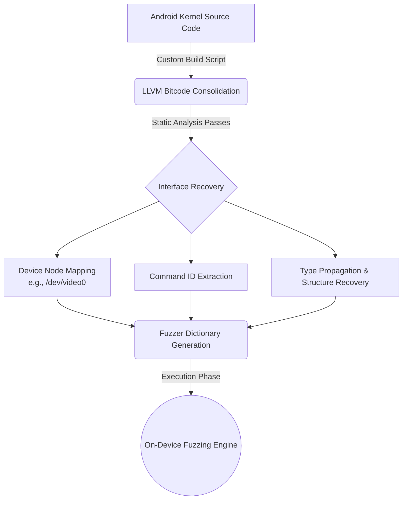

# Chapter 3: DIFUZE — Interface-Aware Fuzzing for Kernel Drivers

The effort to bring automated, generation-based fuzzing to the Android ecosystem began at its lowest and most privileged architectural layer: the Linux kernel and its associated device drivers. As discussed in the previous chapter, kernel drivers on POSIX systems communicate with userspace almost entirely through the `ioctl` interface, creating a severe structural barrier for traditional fuzzers.

In 2017, Corina et al. presented **DIFUZE** (Interface Aware Fuzzing for Kernel Drivers), the first system to successfully and automatically recover these complex `ioctl` interfaces directly from kernel source code. By integrating compiler-level static analysis with an on-device fuzzing engine, DIFUZE demonstrated that providing a fuzzer with an accurate structural map of a driver's interface dramatically increases the discovery rate of deep memory-corruption vulnerabilities.

## 3.1 The ioctl Challenge: The Camera Module

To grasp the magnitude of the problem DIFUZE solved, consider a hypothetical **Camera Module** implemented as a V4L2 (Video4Linux2) kernel driver. When a userspace process wishes to configure the camera's image sensor, it must issue an `ioctl` system call.

This driver expects a specific command ID, say `VIDIOC_S_SENSOR_CONFIG`, and a pointer to a highly structured memory buffer. Let us imagine the required C-structure looks like this:

```c
struct camera_sensor_config {
    int sensor_id;
    int resolution_width;
    int resolution_height;
    struct lens_calibration_data *calibration_ptr;
};

struct lens_calibration_data {
    int focal_length;
    char manufacturer_string[32];
};
```

When the driver receives the `ioctl` call, its internal dispatcher (often a massive `switch` statement) checks the command ID. If a traditional fuzzer supplies a random integer for the command ID, the driver falls through to the `default` case and returns `-ENOTTY` (Inappropriate ioctl for device). 

If the fuzzer magically guesses `VIDIOC_S_SENSOR_CONFIG` but provides a pointer to random bytes, the driver will copy those bytes from userspace into a `camera_sensor_config` struct in kernel space using `copy_from_user()`. The critical failure occurs when the driver attempts to validate the calibration data. It will read the `calibration_ptr`—which is currently just random garbage bytes generated by the fuzzer—and attempt to dereference it as a memory address. This invalid memory access triggers an immediate kernel panic, crashing the entire operating system before the fuzzer can explore the actual sensor configuration logic.

DIFUZE was designed to read the driver's source code, discover the `VIDIOC_S_SENSOR_CONFIG` command, perfectly reconstruct the `camera_sensor_config` and `lens_calibration_data` structures, and generate inputs that prevent this exact type of shallow crash.

## 3.2 System Architecture: The LLVM Pipeline

DIFUZE operates as a multi-stage pipeline, leveraging the LLVM compiler infrastructure to perform heavy static analysis on the kernel source before deploying the resulting interface models to a dynamic fuzzing engine.



Because the Linux kernel is typically compiled using GCC, the researchers first engineered a custom build wrapper that intercepts GCC commands and translates them into LLVM `clang` equivalents. This produces an LLVM bitcode representation of the entire kernel, upon which they run custom analysis passes.

## 3.3 Interface Recovery: Mapping the Attack Surface

Before generating inputs, the fuzzer must know *where* to send them. DIFUZE systematically identifies every `ioctl` handler in the kernel. It achieves this by scanning the LLVM bitcode for assignments to specific function pointer fields within known registration structures, such as the `unlocked_ioctl` field within a `file_operations` struct.

Crucially, knowing the handler function is insufficient; the userspace fuzzer must know the exact device file (e.g., `/dev/video0`) to open. DIFUZE performs a backward trace from the identified `ioctl` handler through the kernel's registration API calls (such as `cdev_add` or `misc_register`). By analyzing the arguments passed to these registration functions, DIFUZE can often extract the exact string constant used to name the device node, mapping the internal kernel function directly to its userspace exposure point.

## 3.4 Signature Extraction: The Core Analysis Algorithms

With the entry points mapped, DIFUZE must determine the exact signature of each `ioctl` call. This requires two distinct, highly complex static analysis algorithms: one to find the command IDs, and one to find the data types.

### 3.4.1 Command Value Recovery via Range Analysis
To find all valid `cmd` values accepted by a specific `ioctl` handler, DIFUZE performs a path-sensitive, inter-procedural analysis. It scans the handler function's control flow graph, collecting all equality constraints placed on the `cmd` argument.

Because drivers often use complex `if-else` chains or relational bounds checking (e.g., `if (cmd >= MIN_CMD && cmd <= MAX_CMD)`) rather than simple `switch` statements, DIFUZE utilizes a technique called **Range Analysis**. This algorithm evaluates the mathematical bounds of the variables involved in the conditional checks, allowing it to recover continuous intervals of valid command IDs. This guarantees that the fuzzer's dictionary only contains commands the driver will actually process.

### 3.4.2 Argument Type Recovery via Type Propagation
Once a command ID is identified, DIFUZE must determine the specific C-structure expected as the third argument. This is exceptionally difficult because the signature of the `ioctl` syscall defines this argument as an untyped `unsigned long` or `void*`. 

DIFUZE uses **Type Propagation** to follow the flow of this untyped pointer through the driver's code until it hits a `copy_from_user()` call. 

Returning to our Camera Module example, the LLVM analysis might see the following pseudo-code:
```c
void* arg_ptr = (void*) arg;
struct camera_sensor_config local_config;
copy_from_user(&local_config, arg_ptr, sizeof(local_config));
```
By analyzing the destination of the copy operation (`&local_config`), DIFUZE infers that for this specific execution path (and its associated command ID), the expected input type is a `camera_sensor_config` structure. Furthermore, using a tool like `c2xml`, it parses the original C headers to recursively extract the exact byte-layout, primitive types, and nested definitions of that structure.

## 3.5 Handling the Pointer Problem: Structure Fixup

The most significant technical hurdle for driver fuzzing—and DIFUZE's most critical innovation—is handling structures that contain embedded pointers. In our `camera_sensor_config` example, the `calibration_ptr` field expects a valid memory address pointing to a `lens_calibration_data` structure. A static fuzzer cannot pre-compile a valid memory address because userspace addresses are dynamically assigned at runtime due to Address Space Layout Randomization (ASLR).

DIFUZE solves this entirely at runtime through a technique called **Pointer Fixup**:
1.  **Independent Generation:** The structure generator creates independent, serialized payloads for both the parent structure (`camera_sensor_config`) and the child structure (`lens_calibration_data`).
2.  **Runtime Allocation:** Before issuing the `ioctl` call, the on-device fuzzer process allocates distinct blocks of userspace memory (using `mmap` or `malloc`) and loads the generated payloads into them.
3.  **Address Translation:** The fuzzer determines the actual virtual address of the memory block holding the child structure. It then writes this exact 64-bit virtual address into the `calibration_ptr` field of the parent structure.

When the `ioctl` call is finally made, the kernel's `copy_from_user()` successfully reads the parent structure. When the driver's deep logic subsequently attempts to dereference the `calibration_ptr`, it reads a valid userspace address. The kernel safely follows the pointer back into the fuzzer's controlled memory space, reading the mutated `lens_calibration_data` without crashing. This pointer fixup mechanism is what allows DIFUZE to penetrate deeply nested driver logic that destroys naïve fuzzers.

## 3.6 On-Device Execution: MangoFuzz, Syzkaller, and the Heartbeat

Because kernel panics inherently crash the entire operating system, testing drivers is highly disruptive. DIFUZE requires a robust, fault-tolerant execution architecture. 

The researchers implemented their on-device fuzzing engine in two forms. The first was a bespoke, highly targeted prototype named **MangoFuzz**. MangoFuzz was intentionally stripped of advanced features like coverage guidance to prove a theoretical point: that providing interface structure alone, even to a dumb fuzzer, radically improves bug discovery. To prove real-world viability, they also integrated their static analysis pipeline into **Syzkaller**, Google's industry-standard, coverage-guided kernel fuzzer, transforming it from an interface-blind tool into an interface-aware juggernaut.

To manage the inevitable system crashes, DIFUZE runs its executor daemon on the target Android device (e.g., a physical Google Pixel or Samsung Galaxy) while a host machine maintains a continuous **Heartbeat** connection over the Android Debug Bridge (ADB). As the fuzzer iterates, it logs the exact sequence of structures and command IDs sent to the kernel. If the heartbeat unexpectedly drops, the host immediately infers that a kernel panic occurred. It retrieves the logged execution sequence—saving the exact input that triggered the vulnerability—and automatically issues a hardware reboot command to the device, seamlessly resuming the fuzzing campaign once the OS restarts.

## 3.7 Real-World Impact and Inherent Limitations

In its evaluation across seven commercial Android devices, DIFUZE discovered 36 bugs, 32 of which were previously unknown zero-day vulnerabilities, including critical memory-corruption flaws leading to arbitrary code execution. The data proved the core thesis: augmenting a fuzzer with complex structure definitions increased the bug discovery rate by an astonishing 54.5%.

Despite this success, DIFUZE is constrained by two fundamental limitations. First, it is **semantically blind**. While it knows the physical byte-layout of a structure, it cannot understand relationships between fields. If a driver requires that `field_A` must always be mathematically greater than `field_B`, DIFUZE cannot deduce this from structural type definitions alone. It relies entirely on random mutation to eventually stumble upon a valid mathematical combination.

Second, and most critically, DIFUZE is entirely bound by the **Source Code Barrier**. Its entire LLVM static analysis pipeline requires the ability to compile the kernel from scratch. While Linux kernel drivers are largely open-source due to GPL licensing requirements, the Android ecosystem contains vast swathes of proprietary, closed-source binaries running in userspace—specifically within the Hardware Abstraction Layer (HAL). As the attack surface shifted upwards into these native system services, DIFUZE's source-reliant methodology became fundamentally blind to a massive portion of the modern Android threat landscape. Overcoming this barrier required a conceptual leap up the stack, leading directly to the development of systems like FANS.
