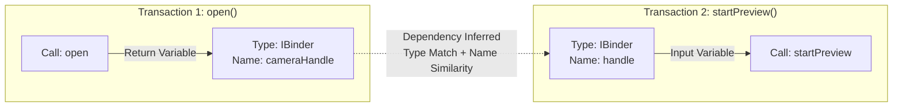

# Chapter 4: FANS — Moving Up the Stack to System Services

Published at USENIX Security '20, **FANS** (Fuzzing Android Native Services) addresses the critical attack surface above the kernel: the native system services that manage the core functionality of the Android OS. These services communicate via the Binder IPC mechanism, presenting a different set of challenges than the `ioctl` interface targeted by DIFUZE.

## 4.1 The Binder Challenge: The Running Example

In our camera running example, the Android framework provides the `cameraserver` service. This service exposes its functionality through the Binder IPC mechanism. When a process wants to use the camera, it calls a transaction on the `cameraserver`.

The arguments for this call are serialized into a **Parcel**. On the server side, the `onTransact` method receives the Parcel and deserializes it:
```cpp
// Simplified onTransact dispatch logic
status_t CameraService::onTransact(uint32_t code, const Parcel& data, Parcel* reply, uint32_t flags) {
    switch (code) {
        case CONNECT: {
            String16 clientName = data.readString16();
            int32_t cameraId = data.readInt32();
            // ... connect logic ...
            return OK;
        }
        // ... other transactions ...
    }
}
```
If a fuzzer sends a random Parcel, the transaction will likely fail because the service expects a specific sequence: a string, then an integer. If the fuzzer provides only an integer, the `readString16()` call will fail, and the transaction will be aborted. Blindly fuzzing these services is nearly impossible because of the high structural requirements of the Parcel inputs.

## 4.2 The Multi-Level Interface Problem

FANS identifies a crucial, previously overlooked challenge: **multi-level interfaces.** Many system services are not directly registered with the ServiceManager. Instead, they are obtained through an existing top-level service. For example, a "MediaService" might have a transaction that returns a reference to a "CameraService." FANS' systematic traversal of the service ecosystem found that prior work focused only on the top-level services, missing approximately **37%** of the total attack surface.

## 4.3 AST-Based Extraction: Preserving Semantics

To overcome the interface barrier, FANS uses static analysis on the Android source code. However, while DIFUZE used LLVM bitcode, FANS operates on the **Abstract Syntax Tree (AST)** using Clang. 

This choice is significant because the AST preserves high-level information that is often lost in compiler intermediate representations:
*   **Variable Names:** Crucial for inferring dependencies (e.g., a variable named `cameraId` is likely a reference to a specific camera).
*   **Semantic Types:** Preserving the exact types and their relationships (e.g., typedefs and class hierarchies) that are obscured in bitcode.

### 4.3.1 Model Extraction from the AST
To systematically extract the interface model, FANS [2] traverses the AST of the `onTransact` function and its callees. It specifically looks for seven kinds of sequential statements that interact with the Parcel: read statements (extracting data from the input Parcel), write statements, if statements, switch statements, for/while loops, function calls, and return statements.

By analyzing how variables are populated by these statements, FANS categorizes every variable into one of four classes. It first looks for **sequential variables**, which are data fields read unconditionally in a fixed order. If a read operation is wrapped in conditional branching (like an `if` or `switch` statement), it is classified as a **conditional variable**, and the condition itself is recorded as part of the interface model. When data is read within a loop, FANS classifies it as a **loop variable** and attempts to identify the loop bounds—often a previously read sequential variable—to understand the size of the vector. Finally, it tracks **return variables**, which are the values written to the `reply` Parcel. As I will discuss in the next section, these return variables are essential for identifying dependencies between different transactions.

## 4.4 Dependency Inference: The Multi-Stage Fuzzing Key

One of FANS' most powerful features is its ability to infer dependencies, which are vital for generating inputs that pass semantic checks. It handles three types of dependencies:

### 4.4.1 Interface Dependencies
This handles the multi-level problem. FANS tracks which transactions return new Binder objects. This allows the fuzzer to build a map of how to obtain "child" interfaces from "parent" interfaces.

### 4.4.2 Intra-transaction Dependencies
These occur within a single transaction. For example, if a Parcel contains an array, the first value read is often the size of that array. FANS identifies these relationships by examining the AST to see if one variable is used to determine the count of a subsequent loop or the size of a subsequent read operation.

### 4.4.3 Inter-transaction Dependencies
Inter-transaction dependencies occur when the output (return variable) of one transaction is required as the input (sequential or conditional variable) for a subsequent transaction. This is common in stateful services. For example, in our camera scenario, a client might first call an `open()` transaction which returns a `CameraDevice` handle, and then pass that handle into a `startPreview()` transaction.

Because type information alone is too broad (many functions return an `int` or an `IBinder`), FANS infers these dependencies using a heuristic **Name and Type Matching Algorithm** (Algorithm 1 in the paper):
1. **Collect Outputs:** For a given service, collect all Return Variables from all transactions.
2. **Collect Inputs:** Collect all input variables (Sequential, Conditional, Loop).
3. **Match Type:** For each input variable, find all return variables with the exact same data type.
4. **Match Name:** If multiple return variables have the same type, calculate the string similarity between the variable names. If the names are identical or highly similar (e.g., `cameraId` and `id`), a dependency is inferred.



This dependency graph guides the fuzzer's generation engine: it knows it must successfully execute `open()` and harvest the reply Parcel before it can construct a valid request Parcel for `startPreview()`.

## 4.5 The Fuzzer Engine and Evaluation

The FANS fuzzer is generation-based. It uses the recovered models to create sequences of transactions that respect both the structural and dependency requirements. Its evaluation on 6 Android devices resulted in:
*   **30 Native Vulnerabilities:** Including memory corruptions in critical daemons.
*   **138 Unique Java Exceptions:** Revealing numerous logic flaws.

### 4.5.1 Case Study: The `netd` Inter-transaction Dependency
A particularly sophisticated vulnerability was found in the `netd` (network daemon) service, which is responsible for managing networking on Android. This bug, a stack overflow in `ip6tables-restore`, required a multi-stage attack to trigger.

The vulnerability was reachable through a transaction that expected a Binder reference to another, previously established network interface. FANS found this because of its **Name-Matching Algorithm** for inter-transaction dependencies:
1.  **Dependency Discovery:** FANS' analysis of the AST identified that one transaction returned a Binder object representing a network configuration, while another transaction required that same type as an input.
2.  **Sequence Generation:** The fuzzer automatically generated a sequence of calls: first creating the configuration, then passing the resulting object into the vulnerable transaction.
3.  **Payload Delivery:** Once the dependency was satisfied, FANS used its type-aware mutators to deliver an exceptionally large string within a Parcelable object.

Without the ability to infer and satisfy this inter-transaction dependency, a fuzzer would never have obtained a valid Binder object to pass into the final, vulnerable call. This case demonstrates that for Android services, vulnerabilities are often buried behind complex, multi-stage state machines that only interface-aware systems can navigate.

## 4.6 Limitations: Incomplete State Machines and the Open-Source Blind Spot

Despite its power in navigating Binder dependencies, the FANS authors explicitly noted several critical weaknesses in their approach.

The most significant technical limitation is its **incomplete state machine modeling**. While FANS can successfully chain two transactions together (e.g., `open()` followed by `startPreview()`), it struggles with deep, complex state machines that require three or more specific, ordered transactions to reach a vulnerable state. The heuristic Name-Matching algorithm for inter-transaction dependencies is powerful, but it is ultimately a guess based on string similarity; it cannot perfectly map out the rigid, multi-stage state requirements of complex daemons.

Additionally, like DIFUZE, FANS is entirely dependent on source code. Its Clang AST extraction pipeline simply cannot run on proprietary, closed-source HAL binaries. As the Android ecosystem has evolved, this open-source requirement has become a massive blind spot, missing up to 60% of the native services running on commercial devices.

Finally, FANS remains a black-box fuzzer. It generates inputs based entirely on its static AST models and lacks the dynamic code-coverage feedback necessary to incrementally solve complex execution branches during runtime.
